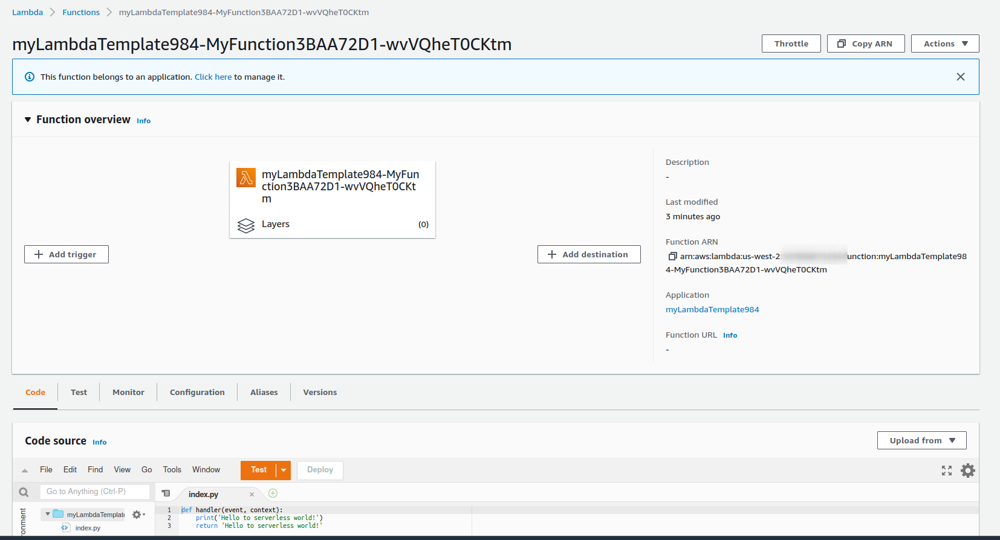

# cdk-lambda-python
This project provides CDK lambda Python template using [Amazon Lambda Python Library](https://constructs.dev/packages/@aws-cdk/aws-lambda-python-alpha/v/2.20.0-alpha.0?lang=typescript) Construct Hub

You only need to focus on your lambda code!

## Pre-condition:
- [CDKv2](https://docs.aws.amazon.com/cdk/v2/guide/getting_started.html) - typescript
- [projen](https://github.com/projen/projen) for managing configuration as code. Run `projen` to install any dependencies which are defined in `.projenrc.ts`

## Create lambda function in 1 min
- Update your lambda function in `src/lambda-handler/index.py`, note keep the handler function name `def handler(event, context)` otherwise you need to update the lambda stack for handler
- Update `src/lambda-handler/requirements.txt` to include dependencies of your lambda function
- Run `cdk deploy` and enjoy!

## Test
```
⚡ $ cdk deploy --profile mfa
Sending build context to Docker daemon  56.32kB
Step 1/8 : ARG IMAGE=public.ecr.aws/sam/build-python3.7
Step 2/8 : FROM $IMAGE
 ---> 7925e2bf1015
Step 3/8 : ARG PIP_INDEX_URL
 ---> Using cache
 ---> a1d6f1dc00ed
Step 4/8 : ARG PIP_EXTRA_INDEX_URL
 ---> Using cache
 ---> 15fcb0ef33fe
Step 5/8 : ARG HTTPS_PROXY
 ---> Using cache
 ---> 6817c749eb44
Step 6/8 : RUN pip install --upgrade pip
 ---> Using cache
 ---> e0b40f3de211
Step 7/8 : RUN pip install pipenv poetry
 ---> Using cache
 ---> 5dada3908df3
Step 8/8 : CMD [ "python" ]
 ---> Using cache
 ---> 8905c3295220
Successfully built 8905c3295220
Successfully tagged cdk-f65e0a7f70b51c1e23b70300445598469a136f74a765801a3f2b6e14509c3443:latest
Bundling asset myLambdaTemplate984/MyFunction/Code/Stage...
WARNING: The directory '/.cache/pip' or its parent directory is not owned or is not writable by the current user. The cache has been disabled. Check the permissions and owner of that directory. If executing pip with sudo, you should use sudo's -H flag.
WARNING: You are using pip version 21.3.1; however, version 22.0.4 is available.
You should consider upgrading via the '/var/lang/bin/python -m pip install --upgrade pip' command.

✨  Synthesis time: 7.86s

myLambdaTemplate984: creating CloudFormation changeset...

 ✅  myLambdaTemplate984

✨  Deployment time: 56.33s

Outputs:
myLambdaTemplate984.MyFunctionOutput = arn:aws:lambda:us-west-2:123456789012:function:myLambdaTemplate984-MyFunction3BAA72D1-wvVQheT0CKtm
Stack ARN:
arn:aws:cloudformation:us-west-2:123456789012:stack/myLambdaTemplate984/c2a29fc0-bf96-11ec-be0f-06cbb1c6f329

✨  Total time: 64.19s
```



- Destroy
  ```
  ⚡ $ cdk destroy -f --profile mfa
    myLambdaTemplate189: destroying...

    ✅  myLambdaTemplate189: destroyed
  ```

---

<h3 align="center">
  <a href="https://dev.to/vumdao">:stars: Blog</a>
  <span> · </span>
  <a href="https://github.com/vumdao/cdk-lambda-python/">Github</a>
  <span> · </span>
  <a href="https://stackoverflow.com/users/11430272/vumdao">stackoverflow</a>
  <span> · </span>
  <a href="https://www.linkedin.com/in/vu-dao-9280ab43/">Linkedin</a>
  <span> · </span>
  <a href="https://www.linkedin.com/groups/12488649/">Group</a>
  <span> · </span>
  <a href="https://www.facebook.com/CloudOpz-104917804863956">Page</a>
  <span> · </span>
  <a href="https://twitter.com/VuDao81124667">Twitter :stars:</a>
</h3>
